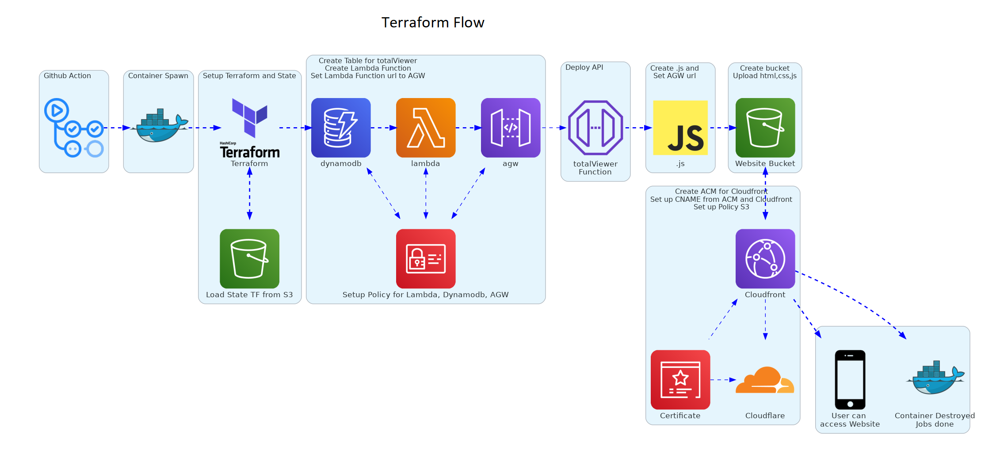

# aws_terraform_resume

## https://stefandi.keysersozeresume.uk


### generated diagram using mingrammer
### https://github.com/mingrammer/diagrams


### How to use on your local computer

### 1. Create terraform.tfvars

```
access_key = accesskey
secret_key = secretaccesskey
region     = yourregion
region_acm = yourregionacm (should be us-east-1)


cloudflare_token = cloudflaretoken
zone_id          = zoneid
account_id       = accountid

domain                    = *.yoururl.com
domain_firstname          = firstdomainname
s3_folder_location_upload = foldername_web


tags                   = tagsname
lambda_function_name   = function name
api_gateway_stage_name = urlname
```

